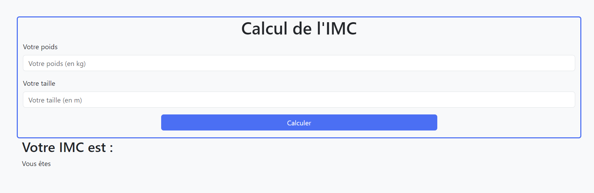

# Body Mass Index (BMI) Calculator

## Description
This small project is a Body Mass Index (BMI) calculator developed in JavaScript, allowing users to calculate their BMI based on their weight and height.

## Features
- BMI calculation by entering user weight (in kilograms) and height (in meters).
- Interpretation of BMI according to the World Health Organization (WHO) categories.
- Simple and intuitive user interface.

## Technologies
This project was developed using Bootstrap for layout and JavaScript for functionality.

## Screenshot


## Installation
1. Clone the repository to your local machine:
   ```bash
   git clone https://github.com/votre-utilisateur/calculateur-imc.git
